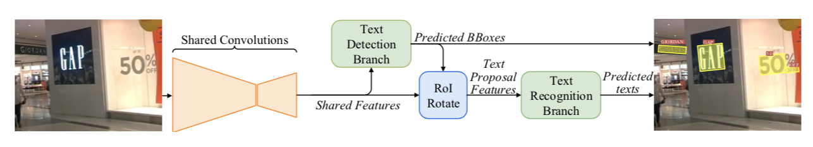
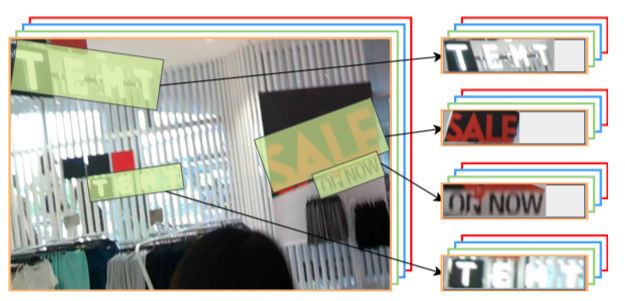
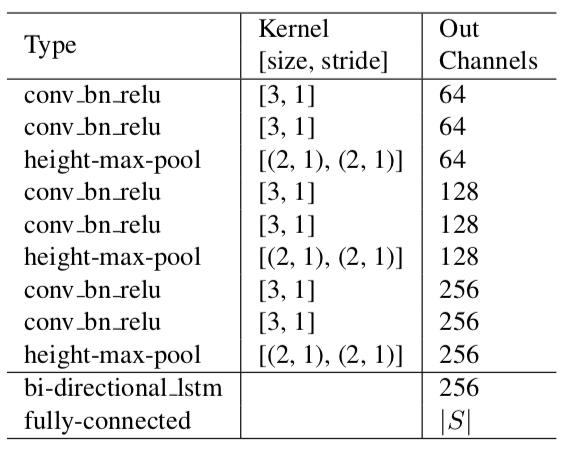

---

---

# FOTS: Fast Oriented Text Spotting with a Unified Network

Xuebo Liu, Ding Liang, Shi Yan, Dagui Chen, Yu Qiao, and Junjie Yan

SenseTime Group Ltd. Shenzhen Institutes of Advanced Technology, Chinese Academy of Sciences.

## Abstract

* Most existing methods treat text detection and recognition as separate tasks.
* end-to-end trainable FOTS network for simultaneous detection and recognition, <u>sharing computation and visual inforamtion among the two complemntary tasks.</u>
* <u>RoIRotate is introduced</u> to share convolutional features between detection and recognition.
* state-of-the-art methods. ICDAR 2015, ICDAR 2018 MLT and ICDAR 2013

## Introduction

* The most common way in scene text readings is to divide it into text detection and text recognition, which are handled as two separate tasks.
* In text detection, usually a convolutional neural network is used to extract feature maps from a scene image, and then different decoders are used to decode the regions.
* Text recognition, a network for <u>sequential prediction is conducted on top of text regions, one by one. It leads to heavy time cost</u> especially for images with a number of text regions.
* seperate architecture ignores the correlation in visual cues shared in detection and recognition.
* <u>The key to connec detection and recognition is the ROIRotate</u>, which gets proper features from feature maps according to the oriented detection bounding boxes.

* The fully convolutional network based oriendted text detection branch is built on top of the feature map to predict the detection boxes.
* The RoIRotate operator extracts text proposal features corresponding to the detection results from the feature map. 
* The text proposal features are then fed into RNN encoder and CTC decoder for text recognition.
* FOTS is the first end-to-end trainable framework for oriented text detection and recognition.

## Methodology

* **Overall Architecture**

  

  * The <u>backbone of the shared network is ResNet-50</u>. Inspired by FPN, concatenate low-level feature maps and high-level semantic feature maps.
  * The <u>text detection branch</u> outputs dense per-pixel prediction of text using features produced by shared convolutions.
  * With oriented text region proposals produced by detection branch, the proposed <u>RoIRotate</u> converts corresponding shared features into fixed-height representations while keeping the original region aspect ratio.
  * Finally, the <u>text recognition branch</u> recognizes words in region proposals. CNN and LSTM are adopted to encode text sequence information, followd by a CTC decoder.
  * *Shared conv net architecture*

* **Text Detection Branch**

  * As there are a lot of small text boxes in natural scene images, we upscale the feautre maps from 1/32 to 1/4 size of the original input image in shared convolutions.

  * After extracting shared features, one convolution is applied to output dense per-pixel predictions of words. 

  * The first channel computes the probability of each pixel being a positive sample. Similar to EAST, pixels in shrunk version of the original text regions are considered positive. For each positive sample, the following 4 channels predict its distances to top, bottom, left, right sides of the bounding box that contains this pixel, and the last channel predict the orientation of the related bounding box. 

  * Final detection results are produced by <u>applying thresholding and NMS</u> to these positive samples.

  * In our experiments, we observe that many patterns similar to text stroke are hard to classify, such as fences, latices, etc. we adopt <u>online hard example mining(OHEM)</u> to better distinguish these patterns.

  * The <u>detection branch loss function is composed of two terms</u>: text classification and bounding box regression. text classification term can be seen as pixel-wise classification loss for a down-sampled score map. <u>Only shrunk version of the original text region is considered as the positive area</u>, while the area between the bounding box and the shrunk version is considered as "NOT CARE", and does not contribute to the loss for the classification.

  * Denote the set of selected positive elements by OHEM in the score map as:
    
    $$
    { L }_{ cls }\quad =\quad \frac { 1 }{ |\Omega | } \sum _{ x\in \Omega  }^{  }{ H({ p }_{ x },{ p }_{ x }^{ * }) }\qquad(Eq.1)
    $$

    $$
    \qquad\qquad\qquad\qquad\qquad\quad\qquad  = \quad \frac { 1 }{ |\Omega | } \sum _{ x\in \Omega  }^{  }{ (-{ p }_{ x }^{ * }log{ p }_{ x }-(1-{ p }_{ x }^{ * })log(1-{ p }_{ x })) }\qquad(Eq.2)
    $$
    

    * where |.| is the number of elements in a set, and $$H({ p }_{ x },{ p }_{ x }^{ * }) ​$$ represents the cross entropy loss between $$p_x​$$, the prediction of the score map, and $$p_x^*​$$, the binary label that indicates text or non-text.
      

  * As for the regression loss, we adopt the IoU loss and the rotation angle loss, since they are robust to variation in object shape, scale and orientation:
    
    $$
    { L }_{ reg }\quad =\quad \frac { 1 }{ |\Omega | } \sum _{ x\in \Omega  }^{  }{IoU(R_x,R_x^*) + \lambda_\theta(1-cos(\theta_x,\theta_x^*))}\qquad(Eq.3)
    $$
    

    * Here, $$IoU(R_x,R_x^*)$$ is the IoU loss between the predicted bounding box $$R_x$$, and the ground truth $$R_x^*$$. 
    * Second term is rotation angle loss. We set the hyper-parameter $$\lambda_\theta$$ to 10 in experiments.
      

  * Therefore the full detection loss can be written as:
    
    $$
    L_{detect} = L_{cls} +\lambda_{reg}L_{reg}\qquad(Eq.4)
    $$
    

    * where a hyper-parameter $$\lambda_{reg}$$ balacnes two losses, which is set to 1 in our experiments.
      

* **ROIRotate**

  * RoIRotate applies transformation on oriented feature regions to obtain axis-aligned feature maps.
    

  

  

  * Fix the output height and keep the aspect ratio unchanged to deal with the variation in text length.

  * Compared to RoIPooling and RoIAlign, <u>RoIRotate provides a more general operation</u> for extracting features for regions of interest. 

  * We also compare to RROI pooling proposed in RRPN. RRoI pooling transforms the rotated region to fixed size region through max-pooling, while we use **bilinear interpolation** to compute the values of the output. <u>This operation avoids misalignments between the RoI and the extracted features, and additionally it makes the lengths of the output features variable, which is more suitable for text recognition</u>.

  * This process can be divided into two steps. 

    * First, affine transformation parameters are computed via predicted or ground truth coordinates of text proposals. Then, affine transformations are applied to shared feature maps for each region respectively, and canonical horizontal feature maps of text regions are obtained. The first step can be formulated as:

      
      $$
      t_x = l*cos\theta - t*sin\theta - x\qquad(Eq.5)
      $$

      $$
      t_y = t*cos\theta + l*sin\theta - y\qquad(Eq.6)
      $$

      $$
      s = \frac {h_t}{t+b}\qquad(Eq.7)
      $$

      $$
      w_t = s * (l + r)\qquad(Eq.8)
      $$

      
      $$
      \\ M\quad =\quad \begin{bmatrix} cos\theta  & -sin\theta  & 0 \\ sin\theta  & cos\theta  & 0 \\ 0 & 0 & 1 \end{bmatrix}\begin{bmatrix} s & 0 & 0 \\ 0 & s & 0 \\ 0 & 0 & 1 \end{bmatrix}\begin{bmatrix} 1 & 0 & t_ x \\ 0 & 1 & t_y \\ 0 & 0 & 1 \end{bmatrix}\qquad(Eq.9)
      $$

      $$
      = s\begin{bmatrix} cos\theta  & -sin\theta  & t_xcos\theta - t_ysin\theta \\ sin\theta  & cos\theta  & t_xsin\theta + t_ycos\theta \\ 0 & 0 & \frac1s \end{bmatrix}\qquad(Eq.10)
      $$

      

    * M is the affine transformation matrix. $$h_t, w_t$$ represent height (equals 8 in our setting) and width of feature maps after affine transformation. $$(x,y)$$ represents the coordinates of a point in shared feature maps and $$(t, b, l, r)$$ stands for distance to top, bottom, left, right sides of the text proposal respectively, and $$\theta$$ for the orientation. $$(t, b, l, r)$$ and $$\theta$$ can be given by ground truth or the detection branch.

    * With the transformation parameters, it is easy to produce the <u>final RoI feature</u> using affine transformation.
      
      $$
      \begin{pmatrix} x_i^s \\ y_i^s \\ 1 \end{pmatrix} \quad= \quad M^{-1} \begin{pmatrix} x_i^t \\ y_i^t \\ 1 \end{pmatrix}\qquad(Eq.11)
      $$
      

      and for ∀i ∈ [1...ht], ∀j ∈ [1...wt], ∀c ∈ [1…C],

      
      $$
      V^{ c }_{ ij }=\sum _{ n }^{ h_s }{ \sum _{ m }^{ w_s }{ U^{ c }_{ nm }k(x^{ s }_{ ij }-m;\Phi _{ x })k(y^{ s }_{ iJ }-n;\Phi _{ y }) }  }\qquad(Eq.12)
      $$
      

      where $$V^{ c }_{ ij }$$  is the output value at location $$(i, j)$$ in channel $$c$$ and $$U^{ c }_{ nm }$$ is the input value at location $$(n, m)$$ in channel $$c$$. $$h_s, w_s$$ represent the height and width of the input, and $$\phi_x, \phi_y$$ are the parameters of a generic sampling kernel $$k()$$, which defines the interpolation methods, specifically bilinear interpolation in this work. As the width of text proposals may vary, in practice, we pad the feature maps to the longest width and ignore the padding parts in recognition loss function.
      

  * Different from object classification, <u>text recognition is very sensitive to detection noise</u>. so we use ground truth text regions instead of predicted text regions during training. 
    

* **Text Recognition Branch**

  * Considering the length of the label sequence in text regions, input features to LSTM are reduced only twice (to 1/4) along width axis through shared convolutions from the original image.

  * Text recognition branch consists of VGG like sequential convolutions, <u>poolings with reduction along height axis only</u>, one bi-directional LSTM, one fully-connection and the final CTC decoder.

  

  * First, spatial features are fed into several sequential convolutions and poolings along height axis with dimension reduction to extract higher-level features.

  * Next, the extracted higher-level feature maps $$L ∈ R^{C ×H ×W}​$$ are permuted to time major form as a sequence $$l_1,…,l_W ∈ R^{C ×H}​$$ and fed into RNN for encoding. Here we use a bi-directional LSTM, with D=256 output channels per direction, to capture range dependencies of the input sequential features.

  * Then, hidden states $$h_1,…,h_W ∈ R^D$$ calculated at each time step in both directions are summed up and fed into a fully-connection, which gives each state its distribution $$x_t ∈ R^{|S|}$$ over the character classes $$S$$. 

  * To avoid overfitting on small training datasets like ICDAR2015, we add dropout before fully-connection.

  * Finally, CTC is used to transform frame-wise classification scores to label sequence. Given probability distribution $$x_t​$$ over $$S​$$ of each $$h_t​$$, and ground truth label sequence $$y^* = {y_1,…,y_T}, T\ll W​$$, the conditional probability of the label $$y^*​$$ is the sum of probabilities of all paths $$\pi​$$ agreeing with:
    
    $$
    p(y^{ * }|x)\quad =\quad \sum _{ \pi\in B^{-1}(y^*) }^{  }{p(\pi|x)  } \qquad(Eq.13)
    $$
    
    * where $$B$$ defines a many-to-one map from the set of possible labellings with blanks and repeated labels to $$y^*$$. 

  * The training process attempts to maximize the log likelihood of summation of Eq.A over the whole training set. the recognition loss can be formulated as:
    
    $$
    L_{recog} \quad = \quad \frac 1N \sum _{ n=1 }^{N}{log p(y_n^*|x)  }\qquad(Eq.14)
    $$
    

    * Where N is the number of text regions in an input image, and $$y_n^*​$$ is the recognition label.
      

  * Combined with detection loss $$L_{detect}​$$ in , the full multi-task loss function is:
    
    $$
    L = L_{detect} + \lambda_{recog}L_{recog}\qquad(Eq.15)
    $$
    

    * where a hyper-parameter $$\lambda_{recog}$$ controls the trade-off between two losses.  $$\lambda_{recog}$$ Is set to 1 in our experiments.

## Conclusion

* A novel RoIRotate operation is proposed to unify detection and recognition into an end-to-end pipeline. <u>By sharing convolutional features, the text recognition step is nearly cost-free, which enables our system to run at real-time speed.</u> 